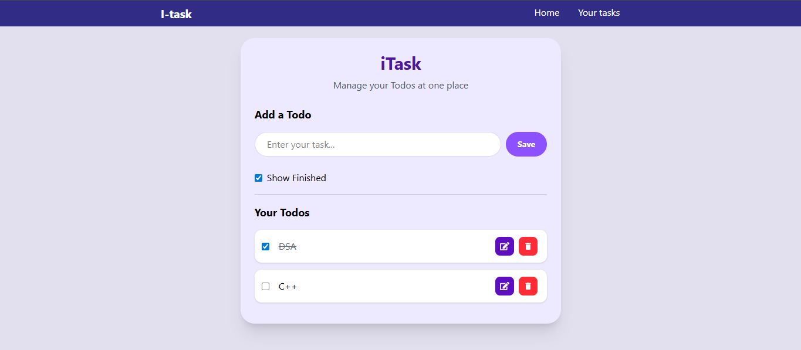

# 📝 iTask Todo App

A simple and responsive task management application built with React. iTask helps users organize, track, and manage their daily tasks efficiently with a clean and user-friendly interface.

## 🌐 Live Demo

🔗 **Try iTask here:**  
[Live Demo](https://todo-list-webapp-coral.vercel.app/)

## 🚀 Features

- ➕ Add new tasks
- ✏️ Edit existing tasks
- 🗑️ Delete tasks
- ✅ Mark tasks as completed
- 👀 Show/Hide completed tasks
- 💾 Local Storage support (tasks persist after page refresh)
- 📱 Fully responsive design
- 🎨 Clean and modern UI

## 🛠️ Tech Stack

- React.js
- Vite
- Tailwind CSS
- React Icons
- UUID

## 📂 Project Structure

```bash
src/
├── components/
│   └── Navbar.jsx
├── App.jsx
├── index.css
└── main.jsx
```

## ⚙️ Installation

1. Clone the repository

```bash
git clone 
```

2. Navigate to the project folder

```bash
cd itask-todo-app
```

3. Install dependencies

```bash
npm install
```

4. Start the development server

```bash
npm run dev
```

## 📸 Preview



## 🌟 Future Improvements

- Dark Mode
- Due Dates
- Task Categories
- Search & Filter Tasks
- Drag and Drop Support
- Backend Integration

## 📄 License

This project is open source and available under the MIT License.

---

Made with ❤️ using React and Tailwind CSS.